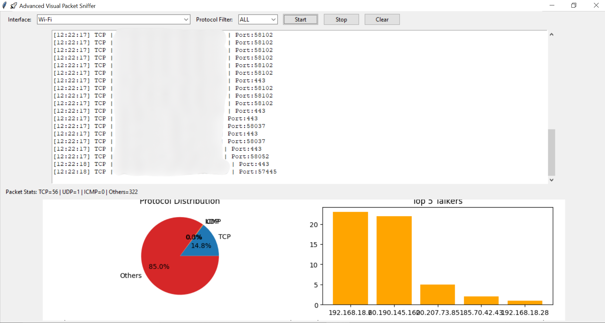
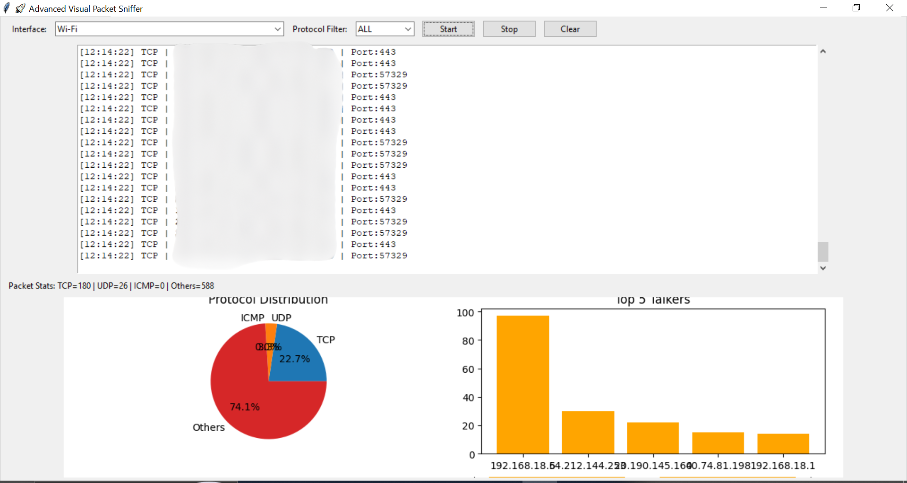
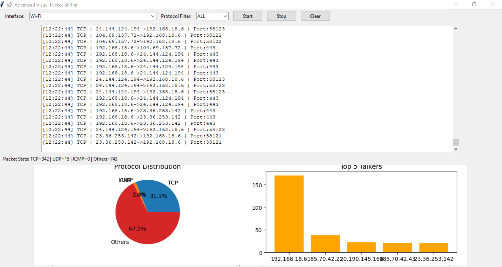

# 🕵️‍♂️ Network Packet Sniffer (Educational Project)

 **Python-based Network Packet Sniffer with GUI**, built using **Scapy**, **Tkinter**, and **Matplotlib**.  
This tool captures live packets, displays real-time protocol distribution, and provides a simple GUI for starting/stopping the sniffer.

⚠️ **Disclaimer:** This project is built **strictly for educational and learning purposes only**.  
Do **NOT** use it for malicious or unauthorized activities.

---

## ✨ Features
- ✅ Capture live network packets in real time  
- ✅ GUI controls (Start / Stop sniffer)  
- ✅ Real-time **protocol distribution pie chart**  
- ✅ Interface selection (choose network adapter)  
- ✅ Lightweight & built with pure Python  

---

## 🛠️ Installation

1. Clone the repository:
   
   git clone https://github.com/YOUR-USERNAME/network-packet-sniffer.git
   cd network-packet-sniffer
2. Create a virtual environment (recommended):
   python -m venv .venv
3. Activate the virtual environment:
4. 
5. powershell
     .venv\Scripts\activate
   * Linux/Mac:
     source .venv/bin/activate
6. Install dependencies:
   pip install -r requirements.txt
## ▶️ Usage
Run the GUI:
python sniffer_gui.py
* Select your **network interface**
* Click **Start Sniffer**
* Watch real-time protocol stats update!
## 📸 Screenshots:

## 📦 Requirements:
* Python 3.9+ (tested on 3.13)
* [Scapy](https://scapy.net/)
* Matplotlib
* Tkinter (usually included with Python)
Install via:
pip install scapy matplotlib
## 🙌 Acknowledgements
* [Scapy Documentation](https://scapy.readthedocs.io/)
* [Matplotlib](https://matplotlib.org/stable/gallery/index.html)
## ⚠️ Legal Note :
This software is provided **as is** without warranty.
The author is **not responsible** for any misuse.
Use this tool only on **your own network** or with **explicit permission**.
👉 I also recommend you add a simple `requirements.txt` with:  
scapy
matplotlib

